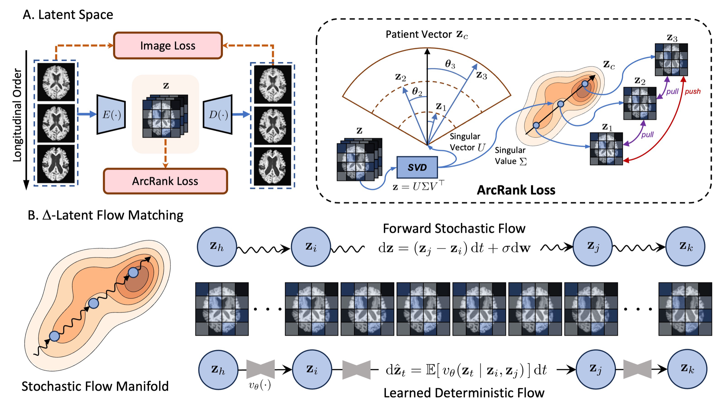
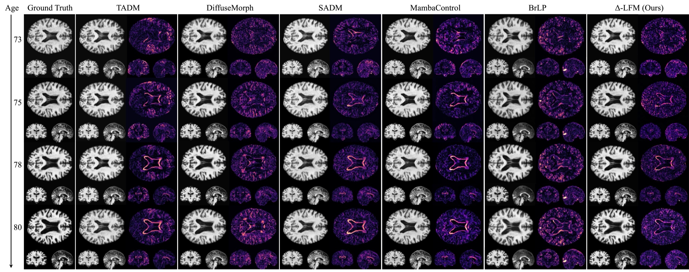
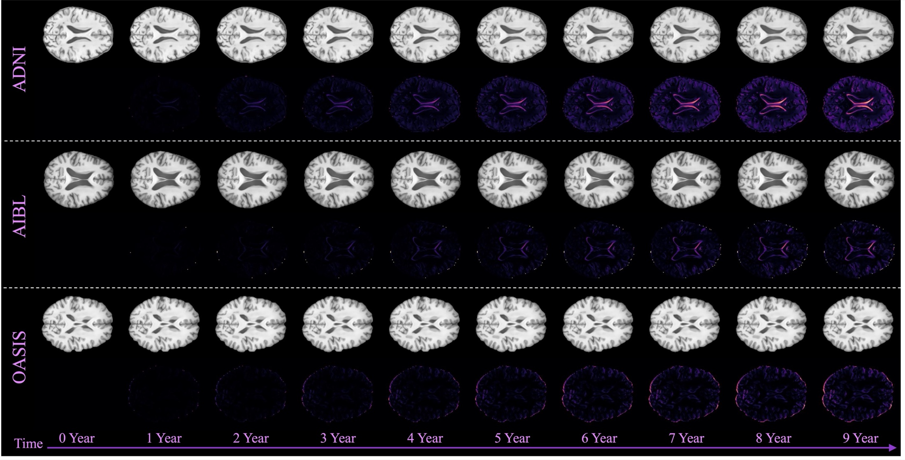
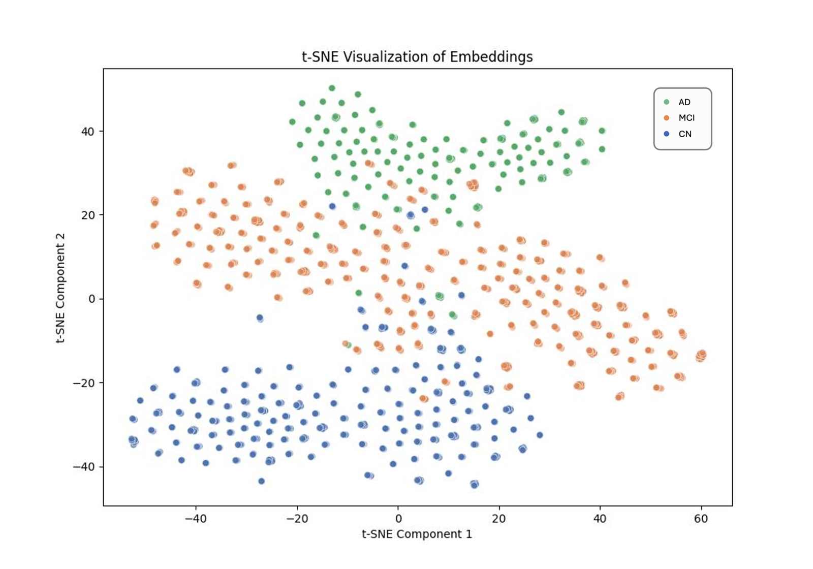
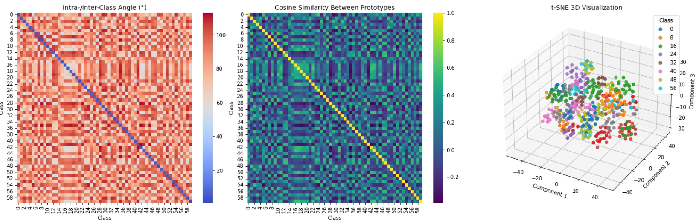

# Δ-LFM — Learning Patient-Specific Disease Dynamics with Latent Flow Matching

[](https://openreview.net/forum?id=cuGnuOfQ4U)

📄 **Paper:** <https://openreview.net/forum?id=cuGnuOfQ4U>

Reference implementation for the ICLR 2026 paper
[*Learning Patient-Specific Disease Dynamics With Latent Flow Matching For Longitudinal
Imaging Generation*](https://openreview.net/forum?id=cuGnuOfQ4U).

A minimal, self-contained copy of the verified pipeline: train a 3D autoencoder,
extract latents, train a flow-matching model over latent *change*, and evaluate with
change-aware metrics.

<p align="center">
  
</p>
<p align="center"><em><strong>Top:</strong> latent-space learning — an autoencoder trained with
an L1 reconstruction loss and an <strong>ArcRank</strong> loss that orders each subject's visits
angularly about a class centre. <strong>Bottom:</strong> flow matching — a deterministic flow
<code>u<sub>t</sub>(x<sub>t</sub> | x<sub>0</sub>, x<sub>1</sub>)</code> is learned against the
forward stochastic flow on the training manifold.</em></p>

This branch contains **only** what is needed to reproduce the recipe in
[`RECIPE.md`](RECIPE.md). All paths are configured through environment variables; no
machine-specific paths are hard-coded.

---

## Pipeline

```
../AD_data_processing/     Stage 0  raw scans -> (baseline, follow-up) pair CSV  (shared)
step1_v2_axes.py            Stage 1  train the 3D autoencoder
step2_extract_latents.py    Stage 2  encode every visit to a latent
probe_flowinit_sigma.py     Stage 2b measure the flow-initialization noise scale for your latents
step3_train_flowmatching.py Stage 3  flow matching on the latent change δ = z₁ − z₀
                                     (base stage, then a fine-tune with the change-aware terms)
eval_fm.py                  Stage 4  sample, decode, score (latent-decoded and original scan space)
```

Supporting modules:

| Path | Contents |
|---|---|
| `src/autoencoder/` | MAISI 3D VAE wrapper (`MAISI_Unet3D.init_autoencoder`) |
| `src/model3D/` | flow-matching UNet, history encoder |
| `src/change_f1.py`, `src/delta_f1.py` | change-aware metrics (see below) |
| `src/change_f1_soft.py` | low-variance cF1 and the maths of the `--fm_cf1_w` fine-tune loss |
| `src/flow.py`, `src/trajectory_losses.py`, `src/contrastive_losses.py` | losses |
| `dataset/` | longitudinal pair/triplet loaders |
| `utils/options.py` | every command-line flag, each documented inline |
| `config/default/` | the three YAML configs the recipe uses |
| [`../AD_data_processing/`](../AD_data_processing/) | Stage 0, shared with MambaControl: per-visit table -> longitudinal pairs -> cleaning -> prior-visit columns |

---

## Quickstart

```bash
# 0. environment
pip install torch monai diffusers nibabel pandas scikit-image lpips

# 1. point at your data (a directory containing Image/<subject>/<date>/t1.nii.gz)
export DATA_DIR=/path/to/dataset
export WORK_DIR=/path/to/outputs
export DERIVED_DIR=$DATA_DIR/derived   # optional; defaults to $DATA_DIR/derived
                                       # holds population priors, PCA bases and energy maps

# 2. build the pair CSV from raw scans (skip if you already have one)
export RAW_DATA_DIR=/path/to/raw/cohort
bash scripts/00_prepare_data.sh

# 3. run the stages — exact flags are in RECIPE.md
bash scripts/01_train_autoencoder.sh
export AE_CKPT=$WORK_DIR/ae/all-ae-<EP>-3D.pth   # the autoencoder checkpoint you selected
bash scripts/02_extract_latents.sh
bash scripts/02b_probe_sigma.sh          # prints --fm_flowinit_sigma <value>
export SIGMA=<value>
# the default is direct change prediction; STOCHASTIC=1 selects the flow variant (RECIPE.md, section 6)
bash scripts/03_train_flow_matching.sh            # base stage, 30 epochs
export FM_BASE_CKPT=$WORK_DIR/fm_base_rectified/fm-unet-ep-<EP>.pth
bash scripts/03b_finetune_flow_matching.sh        # fine-tune, 10 epochs
bash scripts/04_evaluate.sh <EP> adni    # run three consecutive epochs; report the mean
```

The MAISI VAE checkpoint (`autoencoder_epoch273.pt`, ~80 MB) is **not** committed;
`src/autoencoder` downloads it on first use.

### Expected data layout

```
$DATA_DIR/
  Image/<subject_id>/<yyyy-mm-dd>/t1.nii.gz
  derived/<cohort>.csv     # one row per (baseline, follow-up) pair
```

The CSV needs at minimum `subject_id`, `starting_image_path`, `followup_image_path`,
`starting_age`, `followup_age`, `sex`. Optional prior-visit columns
(`prior_image_path`, `has_prior`, …) enable the history-conditioned variant.

---

## Results

Qualitative comparison against TADM, DiffuseMorph, SADM, MambaControl and BrLP on one
subject followed from age 73 to 80. Each method shows its prediction (axial and coronal)
next to its error map against the ground truth.

<p align="center">
  
</p>

Because the model is conditioned on a continuous Δt rather than a fixed step, one baseline
scan can be rolled forward to any horizon. Below: 0–9 years on ADNI, AIBL and OASIS, with
the accumulated change map beneath each prediction.

<p align="center">
  
</p>

The ArcRank objective orders visits in latent space; the learned embedding separates
diagnostic groups without being trained on the labels.

<p align="center">
  
</p>
<p align="center"><em>t-SNE of the learned embeddings, coloured by diagnosis (AD / MCI / CN).
Diagnosis labels are not used during training.</em></p>

<p align="center">
  
</p>
<p align="center"><em>Angular structure induced by ArcRank. <strong>Left:</strong> intra- and
inter-class angles. <strong>Centre:</strong> cosine similarity between class prototypes.
<strong>Right:</strong> the same embedding in three dimensions.</em></p>

---

## Metrics

Ordinary PSNR/SSIM are dominated by the unchanged anatomy: **copying the baseline
scan already scores near-optimal PSNR**, so image-fidelity metrics alone cannot tell
whether a model predicted *change*. Every metric below is therefore computed on the
**change field** rather than the image.

### Setup

Let $x_0$ be the baseline, $x_1$ the real follow-up and $\hat{x}_1$ the prediction.
All quantities are evaluated on the brain mask
$\Omega = \lbrace  x_0 > 0.05 \rbrace  \cup \lbrace  x_1 > 0.05 \rbrace $ (or a supplied mask), and the two
change fields are

$$\Delta_{\text{gt}} = x_1 - x_0, \qquad \Delta_{\text{pred}} = \hat{x}_1 - x_0 .$$

The region-based metrics share one per-volume threshold, set relative to the change
actually present in that subject rather than to a fixed constant:

$$\tau = \text{frac} \cdot P_{99}\big(|\Delta_{\text{gt}}|\big), \qquad \text{frac} = 0.25 .$$

### cF1 — primary metric

`src/change_f1.py`. Define the true- and predicted-change regions

$$R = \lbrace  |\Delta_{\text{gt}}| > \tau \rbrace , \qquad P = \lbrace  |\Delta_{\text{pred}}| > \tau \rbrace ,$$

and take the least-squares projection of one change field onto the other on each region:

$$\mathrm{Recall} = \mathrm{clip}\left(\frac{\sum_{R} \Delta_{\text{gt}}\Delta_{\text{pred}}}{\sum_{R} \Delta_{\text{gt}}^{2}},  0,  1\right), \qquad
\mathrm{Precision} = \mathrm{clip}\left(\frac{\sum_{P} \Delta_{\text{gt}}\Delta_{\text{pred}}}{\sum_{P} \Delta_{\text{pred}}^{2}},  0,  1\right),$$

$$\mathrm{cF1} = \frac{2 \cdot \mathrm{Precision} \cdot \mathrm{Recall}}{\mathrm{Precision} + \mathrm{Recall}} .$$

Recall is the slope of regressing $\Delta_{\text{pred}}$ on $\Delta_{\text{gt}}$ over $R$
(how much of the real change was produced); Precision is the reverse regression over $P$
(how much of the produced change is supported by real change). Clipping at 0 makes a
sign-flipped prediction score 0 rather than negative.

The scale behaviour follows directly: for $\Delta_{\text{pred}} = c \Delta_{\text{gt}}$,
Recall $= \min(c,1)$ and Precision $= \min(1/c, 1)$, so the score is **symmetric in
$c \leftrightarrow 1/c$ and peaks at $c = 1$** — amplitude cannot be traded for score.

| $\Delta_{\text{pred}}$ | Recall | Precision | cF1 |
|---|---|---|---|
| $\Delta_{\text{gt}}$ (exact) | 1 | 1 | **1.000** |
| $0.5 \Delta_{\text{gt}}$ | 0.5 | 1 | 0.667 |
| $2 \Delta_{\text{gt}}$ | 1 | 0.5 | 0.667 |
| $-\Delta_{\text{gt}}$ (sign-flipped) | 0 | 0 | 0.000 |
| $0$ (copy baseline) | 0 | — ($P$ empty) | 0.000 |
| noise independent of $\Delta_{\text{gt}}$ | ≈0 | ≈0 | ≈0.000 |

### Supporting metrics

**dF1** (`src/delta_f1.py`) — soft, magnitude-weighted. With per-voxel agreement
$a = 1 - |\Delta_{\text{gt}} - \Delta_{\text{pred}}| / (|\Delta_{\text{gt}}| + |\Delta_{\text{pred}}|) \in [0,1]$:

$$\mathrm{Recall} = \frac{\sum |\Delta_{\text{gt}}| a}{\sum |\Delta_{\text{gt}}|}, \qquad
\mathrm{Precision} = \frac{\sum |\Delta_{\text{pred}}| a}{\sum |\Delta_{\text{pred}}|} .$$

**rF1** (`src/delta_f1.py`) — hard region F1, the binary counterpart of dF1. A voxel counts
as a true positive only if it exceeds $\tau$ in **both** fields *and* the two changes share
a sign:

$$\mathrm{TP} = |\lbrace  |\Delta_{\text{gt}}| > \tau \rbrace  \cap \lbrace  |\Delta_{\text{pred}}| > \tau \rbrace  \cap \lbrace  \mathrm{sign} \Delta_{\text{gt}} = \mathrm{sign} \Delta_{\text{pred}} \rbrace | .$$

Note that rF1 is **not** amplitude-symmetric: it increases monotonically with $c$, which is why
cF1 is the primary metric.

**CHANGE_PCC** (`utils/utils_metric.py`) — Pearson correlation between
$\Delta_{\text{gt}}$ and $\Delta_{\text{pred}}$ over $\Omega$. Threshold-free and
**scale-invariant**, so it is unaffected by amplitude.

**CHANGE_MAE** — $\mathrm{mean}_{R} |\Delta_{\text{gt}} - \Delta_{\text{pred}}|$, the absolute
error between the two *signed* change fields, restricted to the true-change region.

**CHANGE_DICE** — direction-aware Dice over $\lbrace \Delta > \tau\rbrace $ and $\lbrace \Delta < -\tau\rbrace $,
weighted by the prevalence of each direction, so a wrong-direction prediction scores ≈0
instead of a spurious 1.

**DRMAE** — $\mathrm{mean} |\Delta_{\text{pred}} - \Delta_{\text{gt}}|   /   \mathrm{mean} |\Delta_{\text{gt}}|$.
By construction $\mathrm{DRMAE} = 1$ for the copy baseline, so values below 1 are the only
ones that beat predicting no change.

### Two rules that make these numbers interpretable

1. **Amplitude is a free lever.** Predictions are systematically under-scaled
   ($c < 1$), so multiplying by a constant moves them toward the cF1 peak at $c = 1$
   while lowering PSNR. cF1 removes the *unbounded* version of this lever — it cannot
   be driven past 1 by overshooting — but a single operating point is still not a fair
   comparison. Always compare at matched PSNR, or report the whole amplitude curve.
   For rF1 the lever is unbounded and the problem is worse.
2. **A real gain moves cF1 and CHANGE_PCC in the *same* direction.** CHANGE_PCC is
   scale-invariant, so `cF1 ↑ with CHANGE_PCC ↓` is the signature of amplitude
   inflation rather than a better prediction.

---

## Evaluation protocol

The evaluation standard (test partition, sampling, checkpoints, and the two output spaces:
latent-decoded and original scan) is defined in [`RECIPE.md`](RECIPE.md#7-evaluation). Every
result is reported next to the copy baseline (predict no change).

Baseline and follow-up images are intensity-normalised per volume, so the measured change between
two scans also contains an intensity component in addition to anatomical change. Compare methods
under the same normalisation.

---

## Changelog

### 2026-09-15

- **Direct regression of the change δ = z₁ − z₀ (`--fm_x0_pred 1`) is now the default**, evaluated in
  one deterministic pass. The stochastic flow from noise with antithetic averaging is kept as an
  option.
- **The change-direction term is off.** Of the change-aware terms it holds back the change amplitude
  the most, so the fine-tune stage uses the energy mask and the soft cF1 surrogate only.
- **Flow matching is staged.** The base stage trains on the flow loss alone; the energy mask, the
  differentiable cF1 surrogate and the direction term are added only in a short fine-tune. Switching
  them on from the start slows how fast the model recovers the change amplitude, and a prediction
  that spreads its change smoothly instead of placing it comes out blurred. `--fm_cf1_w` is off by
  default and set explicitly in the fine-tune stage.
- One recipe, `RECIPE.md`, with a section per component: setup, data, autoencoder, latents,
  noise-scale probe, flow matching, evaluation.
- Autoencoder recipe: native-resolution brain patches, change-aware reconstruction terms, and the
  ArcRank and contrastive terms recommended (`ARCRANK=0` omits them).
- `probe_flowinit_sigma.py` measures the flow-initialization noise scale, which depends on the
  autoencoder, the resolution and the cohort, instead of carrying a fixed value.
- Evaluation standard (`RECIPE.md`, section 7): `--raw_out` produces and scores the image output in
  the original scan space with the same metric panel as the latent-decoded output, each reported
  next to its copy baseline; the noise scale is read from the checkpoint's `args.json`;
  `FM_PAIR_KEYS` restricts evaluation to a fixed pair list; every result records what was evaluated.
- Autoencoder triplets are split by an md5 of the subject id, so the split is the same on every run.
- Fixes: the YAML configs expand `${DATA_DIR}` / `${WORK_DIR}`; the two `utils_usage` modules that
  stages 1 and 3 import are included; `--output_dir` is documented as relative to `--temp_path`.
- Repository cleanup: the analysis and ablation scripts, the previous recipe's result logs, measured
  values in comments and argument help text, and dataset identifiers and personal paths in the
  data-preparation notebook were removed. Git history was squashed for the same reason.

### 2026-08-17

- First public release of the Δ-LFM pipeline and the recipe behind the paper's numbers.

---

## Citation

If you use this code, please cite Δ-LFM:

```bibtex
@inproceedings{chen2026deltalfm,
  title     = {Learning Patient-Specific Disease Dynamics With Latent Flow Matching
               For Longitudinal Imaging Generation},
  author    = {Chen, Hao and Yin, Rui and Chen, Yifan and Chen, Qi and Li, Chao},
  booktitle = {International Conference on Learning Representations (ICLR)},
  year      = {2026},
  url       = {https://openreview.net/forum?id=cuGnuOfQ4U}
}
```

This repository also vendors [MAISI](https://github.com/Project-MONAI/tutorials/tree/main/generation/maisi)
(NVIDIA / Project MONAI) as the 3D VAE backbone — please cite it as well if you use the
pretrained autoencoder.

## License

Released under the Apache License 2.0 — see [LICENSE](LICENSE). The vendored MAISI
components (NVIDIA / Project MONAI) retain their own Apache-2.0 notices in the
corresponding source files.
